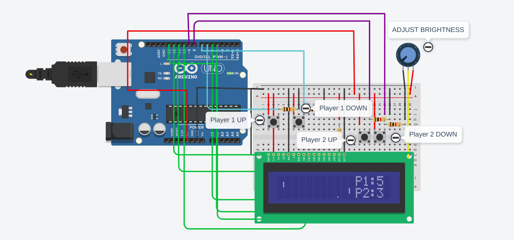

# Pong-Arduino

* The game is designed for two players on a 16x2 LCD display interfaced with arduino UNO.

* Passive components include resisotrs of 1K ohm for four different push buttons. 

* Most of the display is fundamentally a set of custom characters provided by the LiquidCrystalDisplay library of arduino environment.

* The program uses the concept of PIN CHANGE INTERRUPT, considering the fact that push butttons are involved, so in order to make relevant changes with better accuracy and at the same time avoiding polling and making more efficient use of the micro-controller.

* The Pin Change interrupt concept is used as the UNO R3 board only provides two inbuilt pins for external hardware which can be coded using attachInterrupt function, but since four interrupt are required changes are made into relevant inbuilt registers.

* The ball is controlled by caluculating its trajectory using inbuilt sine and cosine functions and distance variables.

* For such low-sized coded tasks, function call can prove to be costly, so the code is least modularised. Although there is a trade-off between user readablity and efficiency, proper comments are provided to aid users analyse the code.

* Circuit diagram is not much user friendly in terms of designing but relevant annotations are provided to aid user enjoy the game.

* A part of the entire LCD display is used to display score board. 

* A maximum score of 7 points is set in the code itself after which the game gets over displaying the winner and restarts again.

### Find Below the image for the ciurcuit design for simulation

